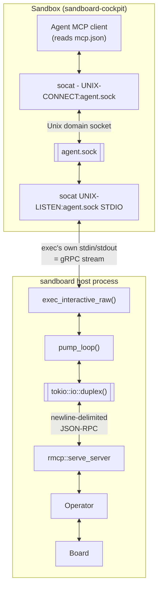

# Cockpit

A durable terminal inside a sandbox that can reach sandboard's operator tools. Use
it when you want an agent that can triage the board with you, rather than one
working a card.

It is the third role in [Concepts](concepts.md#operator-and-worker): narrower
than you (no merges), wider than a card worker (which cannot see the board).

**Prerequisites:** [Your first agent](first-agent.md) setup is live — a healthy
OpenShell gateway and a cockpit sandbox spec in the catalog.

## Start one

In the UI:

1. Open **Cockpit** from the centred chevron grip in the top bar.
2. Click **Start**.
3. Wait a few seconds for the supervisor to provision the sandbox.
4. Type in the terminal.

That is the whole path. Everything below is for automating it or understanding
what it did.

Disconnecting the terminal does **not** stop the session — the sandbox and the
conversation stay up under Start/Stop, and re-attaching resumes the same chat.
Restarting sandboard does not stop it either: the supervisor reconciles, and you just
open Cockpit again.

## What is actually durable

The session is a singleton record on the Board, not a file or a wrapper script:

| Field | Meaning |
|---|---|
| `environment` | Sandbox name — defaults to `sandboard-cockpit` |
| `conversation_id` | Chat id the session resumes; minted if missing |
| `status` | `Running`, or `Parked` — a hold that keeps sandbox and conversation |

The terminal and any CLI attach are **faces over that record**. They read and
mutate it through `Board`; they do not own lifecycle. Create sandboxes through
Board APIs so inventory reconcile stays consistent.

Which image, CPU, memory, engine, and **Policy** (by id) Cockpit gets comes
from the **cockpit sandbox spec** (Settings → OpenShell → Sandbox specs). Edit
allow-list YAML under **Policies**; the spec only references it. Live policy is
set at create and fixed for that sandbox. The sandbox name stays
`sandboard-cockpit` regardless of which spec built it, so you can point
Cockpit at any spec you like.

## Driving it from the CLI

Same Board calls the UI makes. Scripts authenticate with HTTP Basic
(`Authorization: Basic base64(admin:password)`), not the browser session
cookie — no login step, no cookie jar to manage.

```bash
# SANDBOARD_URL = the origin you open the board on (Host / window.location.origin)
# Start (empty body; the supervisor fills in `environment`)
curl -sS -u admin:"$SANDBOARD_PASSWORD" \
  -H 'Content-Type: application/json' -d '{}' \
  "$SANDBOARD_URL/api/cockpit-session"
```

| Intent | Call |
|---|---|
| Start | `POST /api/cockpit-session` |
| Inspect | `GET /api/cockpit-session` |
| Hold without deleting | `POST /api/cockpit-session/park` |
| Continue after a park | `POST /api/cockpit-session/resume` |
| Tear down | `DELETE /api/cockpit-session` |

Attach a host terminal once `environment` is set:

```bash
ENV=$(curl -sS -u admin:"$SANDBOARD_PASSWORD" \
  "$SANDBOARD_URL/api/cockpit-session" | jq -r '.session.environment // empty')
openshell sandbox connect "$ENV"
```

[`scripts/cockpit.sh`](https://github.com/sandboard-app/sandboard/blob/main/scripts/cockpit.sh) is a thin shim over exactly these
calls: `start` / `attach` / `park` / `resume` / `stop`.

Do not `openshell sandbox delete` the cockpit box while a Board session still
points at it. Let `DELETE /api/cockpit-session` drive teardown so inventory
reconcile stays consistent.

## How the browser terminal works

The in-browser terminal is xterm.js over an authenticated WebSocket at
`/api/cockpit-attach`, which opens OpenShell `ExecSandboxInteractive` into the
Board-named environment and runs the cockpit spec's engine. Stdin, stdout, and
resize are relayed over that socket — no local SSH, because a browser cannot
complete the OpenSSH ProxyCommand chain that `openshell sandbox connect` uses.
(That chain is described in [Architecture](architecture.md#how-the-cli-attaches).)

Cursor launches interactive `agent` with `--trust --approve-mcps --sandbox
disabled` — no `--force`, so tool calls still prompt for approval. Headless
Cockpit chat / card runs use the same `--approve-mcps` (with `--force` and
`-p`); without it, Cursor 2026.08+ leaves `mcp.json` servers unloaded
(`needs approval`) and tools look missing even when the socat relay is up.
OpenCode, Claude, and agy launch their own TUIs. Hermes launches its classic
CLI (`hermes --cli`) in the terminal; the modern TUI is intentionally not part
of the sandbox image. Hermes card/chat turns use headless
`hermes chat --query-file …` instead.

## Credentials inside the sandbox

Model auth comes from OpenShell providers. Claude/OpenCode use `inference.local`;
Hermes uses the attached `openrouter-hermes` provider, which injects
`OPENROUTER_API_KEY` only into the sandbox process. No host secret is copied into
the image.

MCP auth from inside the sandbox works differently from the host. Host Cursor
uses browser OAuth against `/mcp`, and that dance does not work cleanly from
inside a sandbox. So the shipped `sandboard` MCP entry is **stdio**, not HTTP: no
login, no Bearer, no OAuth dance to skip.

| Path | Contents |
|---|---|
| `/sandbox/.sandboard/mcp/mcp.json` | `sandboard` → `/sandbox/.sandboard/mcp/sandboard-mcp-stdio` (retries, then `socat` → `agent.sock`) |
| `/sandbox/.sandboard/mcp/claude_mcp.json` | same shape; Claude loads it via `--mcp-config` |
| `/sandbox/.gemini/config/mcp_config.json` | same, for Antigravity |
| `/sandbox/.config/opencode/opencode.jsonc` | OpenCode `mcp.sandboard`, `type: local` |
| `/sandbox/.sandboard/mcp/hermes_mcp.yaml` | Board-rendered `mcp_servers`; the Hermes wrapper merges it into `HERMES_HOME/config.yaml` |

Injection happens when the sandbox becomes Ready, on
`POST /api/cockpit-session/mcp-cred`, and on terminal attach. Do not run
`agent mcp login` inside the sandbox unless you specifically want a separate
host-style OAuth flow.

### How the MCP relay works

sandboard keeps a board-owned `ExecSandboxInteractive` relay running `socat
UNIX-LISTEN:/sandbox/.sandboard/mcp/agent.sock STDIO` inside the sandbox — its
gRPC-piped stdin/stdout are wired straight into the same `Operator` MCP
handler that serves the HTTP `/mcp` endpoint (`rmcp::serve_server` over the
pipe). No port, no network policy entry, no Bearer to mint — same path on
local Docker/Podman and remote Kubernetes, since it never leaves the
sandbox's own netns.



The one-shot listen means agent disconnect is visible on the socket, not
just inferred: `socat` exits, and the board re-spawns for the next connect.
(Not `nc` — the sandbox image's OpenBSD-netcat build accepts the connection
but never forwards bytes written to its stdin *after* accept out to the
socket, which is exactly the `serve_server`-response direction.) See
[Sandbox](sandbox.md).

For agy the attached `antigravity` provider injects only an
`openshell:resolve:…` placeholder, and attach writes that into the sandbox's
token file — never a host OAuth file. Connect once via Settings → Providers →
**Log in with Google** so the gateway can refresh access tokens. See
[Sandbox → Antigravity](sandbox.md#antigravity--agy).

## Cockpit cannot merge either

The cockpit agent prepares and surfaces Review and Needs You. Approving a merge
stays human, same as on the host MCP surface. Prefer escalating an ambiguous
irreversible over widening what `approve_review` / `approve_plan` mean.

## Related

- [Concepts](concepts.md#operator-and-worker) — how the three roles differ
- [Sandbox](sandbox.md#default-vs-cockpit) — default vs Cockpit specs
- [Configuration](configuration.md#policies) — Policies catalog
- [Configuration](configuration.md#sandbox-specs) — picking the spec
